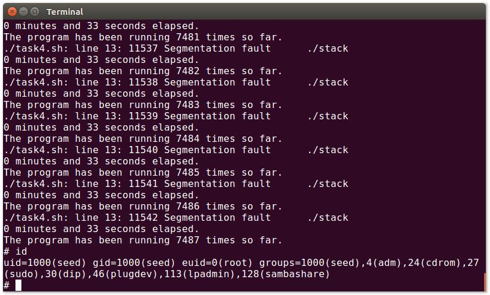

# Buffer Overflow Vulnerability Lab


### Lab Description and Tasks

[Buffer Overflow Vulnerability Lab](Buffer_Overflow.pdf)

Additional information on the SEED project [site](http://www.cis.syr.edu/~wedu/seed/Labs_16.04/Software/Buffer_Overflow/). 

### Reference Slides

- [Buffer Overflow](../lectures/Ch03-BufferOverflow.pdf)
- [Buffer Overflow Attack](../lectures/Buffer_Overflow.pdf)

### Source Files

- [call_shellcode.c](buffer/call_shellcode.c)
- [exploit.c](buffer/exploit.c)
- [stack.c](buffer/stack.c)
- [sp.c](buffer/sp.c)
- [dash_shell_test.c](buffer/dash_shell_test.c)

### Grading

Post your report in Marmoset by the scheduled due date in the syllabus. Your grade for this lab will be composed of:
- 30% - Design
- 30% - Observations
- 40% - Explanation
- *Extra Credit* if you pursue further investigation, beyond what is required by the lab description.

- ### Tips

- To check the current ALSR state: ```$ sudo sysctl kernel.randomize_va_space```
- If you forget to turn off the non-executable stack protection ``` -z execstack``` you will get a *Segmentation fault*
- To compile the ```stack.c``` program using debig flags: ```gcc stack.c -o gbd-stack -g -z execstack -fno-stack-protector```. 
  - Now you can debug ```gdb-stack``` to find the address of ```buffer[]``` and frame pointer ```($ebp)``` 
    - Start debugging by ```gdb gdb-stack```
    - To place a breakpoint at bof: ```b bof``` 
    - To run the program type: ```r```
    - To get address of buffer: ``` p &buffer``` 
    - Address of the frame pointer: ```p $ebp```
    - To find the offset: use ```p``` to substract the two, ex: ```p (0xbfffeb08 - 0xbfffeae8)```
    - You can exit gdb debugging session by typing ```quit```
    
- ```touch badfile``` will create an empty ```badfile```
- Defeating Address Randomization (task 4) 
> 

### If you get stuck
- Task 2 - you need to find 1: *offset to the return address*, and 2: *new return address*
  - ```*((long *) (buffer + /*offset to the return address*/)) = /*new return address*/;```
  - ```memcpy(buffer + sizeof(buffer) - sizeof(shellcode) /*offset to shellcode  */, shellcode, sizeof(shellcode));```
